# 🚀 Création d'une Machine Virtuelle Linux avec Vagrant  

## 📌 Prérequis  
Avant de commencer, assurez-vous d'avoir installé les outils suivants :  
```plaintext 
- Vagrant
- VirtualBox 
- Un terminal (CMD, PowerShell, Bash...)  
- VSCode  
```
---

## 🔧 Initialisation du Projet Vagrant  
### 1️⃣ Créez un répertoire pour votre projet :  
```sh
mkdir CreationVM-Vagrant
cd CreationVM-Vagrant
```
### 2️⃣ Initialisez Vagrant dans ce répertoire  :  
```sh
vagrant init
```
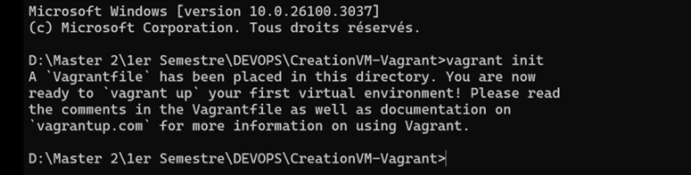  <br>
### 📝 Cela génère un fichier Vagrantfile de configuration.
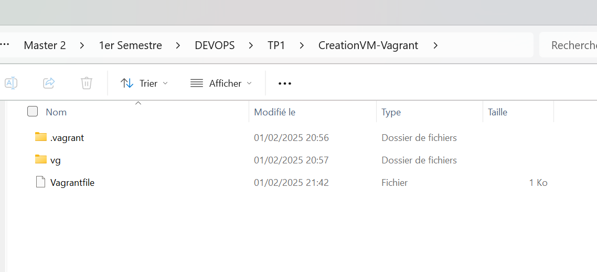

## ⚙ Configuration du Vagrantfile
#### Modifiez le fichier Vagrantfile pour définir la machine virtuelle souhaitée sur VSCode ou votre éditeur préféré. <br>
#### Choisissez une box : Visitez Vagrant Cloud et sélectionnez bento/ubuntu-22.04. 
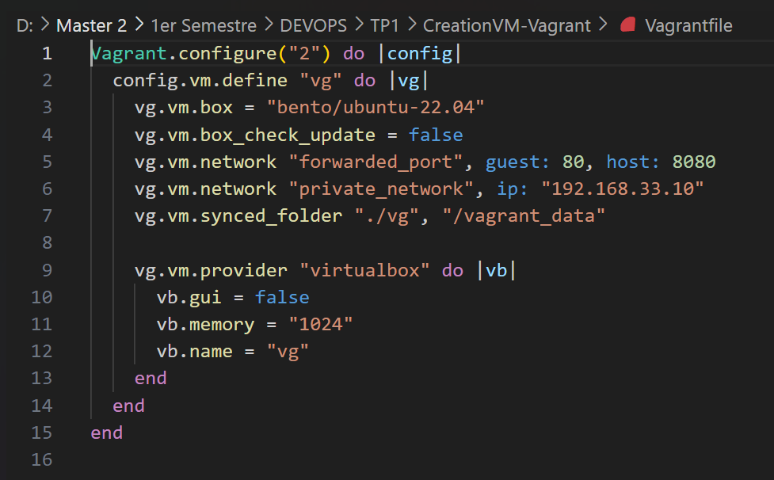

## ✅Validation et Démarrage de la VM
<h3> Après avoir configuré le Vagrantfile, vous pouvez valider la configuration avec cette commande pour vérifier si la configuration est correcte. </h3> 

### 1️⃣ Validez votre configuration
#### Cette commande permet de vérifier si la configuration est correcte :
```sh
vagrant validate
```
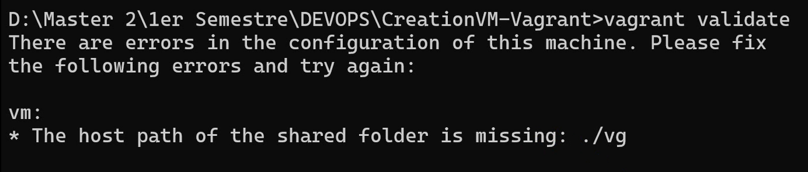 <br>
#### ⚠ L'erreur vient du fait que le dossier vg n'existe pas. Donc, il faut créer le dossier dans le même répertoire que votre Vagrantfile :
```sh
mkdir vg
```
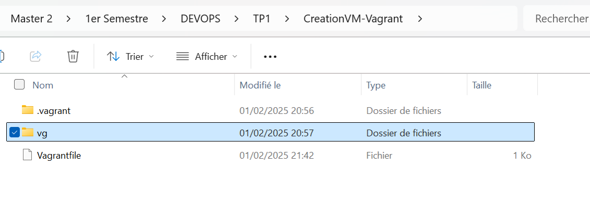
#### Après cela, relancez vagrant validate :
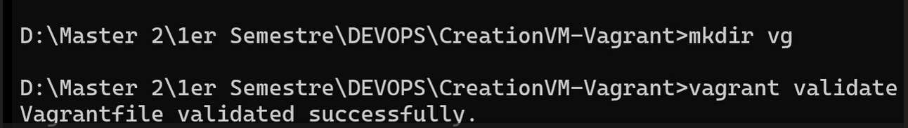

### 2️⃣ Démarrez la machine virtuelle
```sh
vagrant up
```
#### 💡 Cela lance la VM.
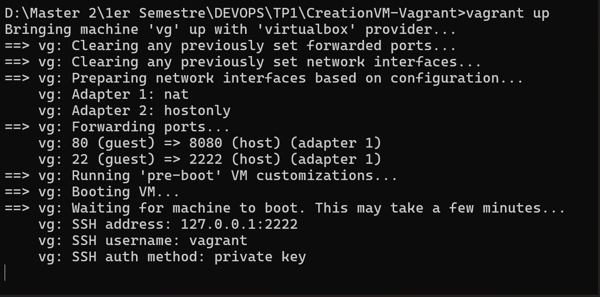
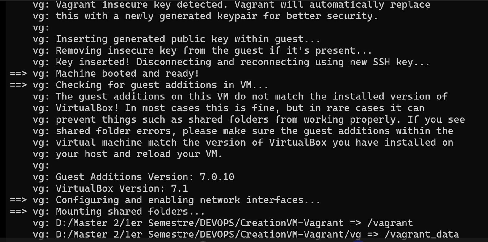
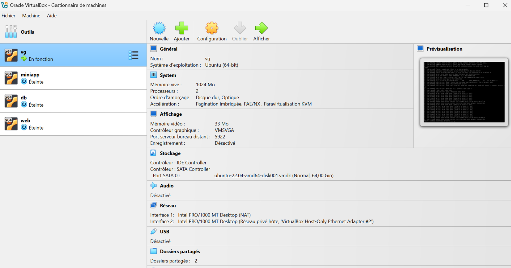

### 3️⃣ Accédez à la VM via SSH
```sh
vagrant ssh vg
```
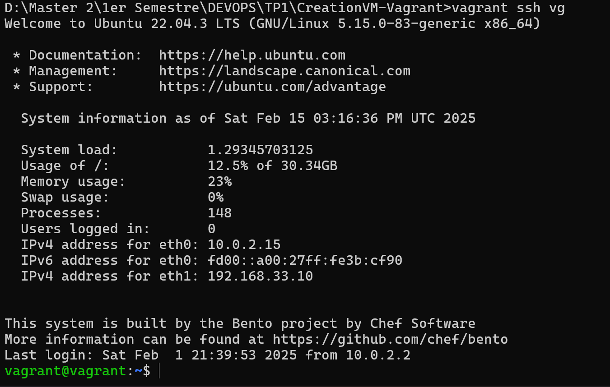

#### Après avoir créé votre machine, vous pouvez vous déconnecter .

### 4️⃣ Déconnexion de la VM
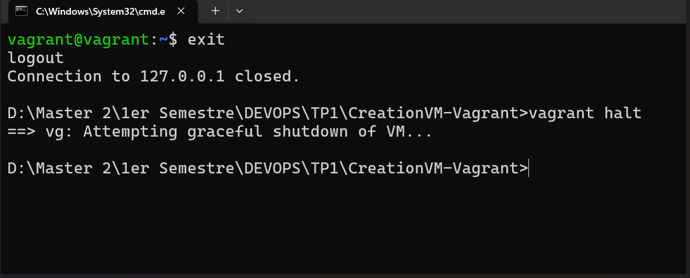
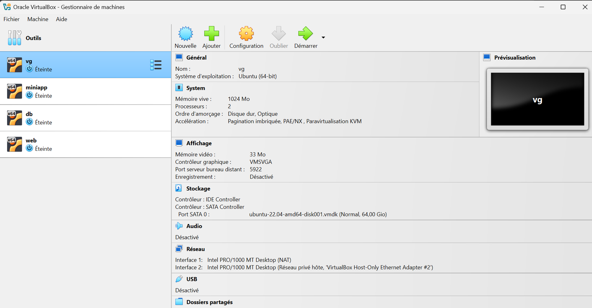

### Notes:
#### Pour Suspendre la VM :
```sh
vagrant suspend
```
#### Pour Arrêter la VM :
```sh
vagrant halt
```
### Ce guide permet de créer rapidement une VM Linux avec Vagrant et VirtualBox. Vous pouvez personnaliser le Vagrantfile pour ajouter plus de ressources ou configurer différents réseaux.

### 👩‍💻 Auteur : KHADIDIATOU DIA
